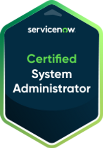

# Certifications
The ServiceNow System Administrator and AWS Solutions Architect – Associate certifications validate foundational skills in managing ServiceNow platforms and designing resilient AWS cloud architectures. Just achieved AWS Certified AI Practitioner.

In earning the AWS Solutions Architect – Associate certification, I developed comprehensive skills in designing secure, cost-efficient, and high-performing cloud solutions on AWS. This journey involved deep technical training, hands-on experience, and real-world problem-solving with AWS services, focusing on core areas like compute, storage, networking, and database. I gained a solid foundation in best practices for architecting resilient solutions, including high availability, disaster recovery, fault tolerance, and scalability, as well as optimizing workloads for cost and performance.
This certification has equipped me for roles such as Cloud Solutions Architect, AWS Cloud Engineer, DevOps Engineer, and Infrastructure Architect—positions that require the ability to translate business requirements into scalable and reliable cloud solutions. My background with AWS enables me to contribute meaningfully by designing architectures that align with an organization’s goals, optimizing for operational efficiency, cost savings, and seamless integration across services. I am ready to bring these skills to a forward-thinking team, leveraging AWS to drive both innovation and operational excellence.

## What is the AWS Certified AI Practitioner? 🚀

This certification validates knowledge of AI/ML concepts and AWS AI services.

### What You Learn:

✅ Core AI/ML Concepts – Understand the difference between AI, ML, and deep learning.

✅ AWS AI Services – Hands-on with services like Amazon SageMaker, Rekognition, Comprehend, Polly, and Lex.

✅ Real-World Use Cases – Learn how AI is applied in industries like healthcare, finance, and retail.

✅ Responsible AI – Ethical considerations and best practices for AI in the cloud.

### Why It’s Valuable:

💡 Helps you understand how AI/ML integrates with AWS cloud solutions.

💡 Sets the foundation for more advanced AWS AI/ML certifications.

💡 Great for cloud engineers, solutions architects, and anyone looking to enhance their AI knowledge.

Earning this cert is another step forward in mastering cloud-based AI and staying ahead in the evolving tech landscape! 🔥

#AWS #AI #MachineLearning #CloudComputing #AWSCertified #AIPractitioner #KeepBuilding 🚀

In earning the ServiceNow System Administrator certification, I built a strong foundation in managing, configuring, and optimizing ServiceNow environments to enhance organizational workflows and efficiency. This certification process required mastering key platform capabilities, including user and group administration, configuration of forms and lists, workflow automation, and implementing security policies. Through hands-on training, I learned how to effectively customize ServiceNow applications to align with business processes and improve user experiences.
With these skills, I am well-prepared for roles such as ServiceNow Administrator, ServiceNow Developer, IT Service Management (ITSM) Specialist, and Business Process Analyst. My expertise in ServiceNow enables me to streamline IT service operations, automate processes, and contribute to a more agile IT infrastructure—helping companies optimize their ServiceNow platform for operational excellence.
